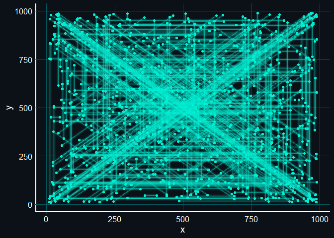

Advent of Code 2021
================

Solving the [advent of code](https://adventofcode.com/) puzzles in R.

Here is a little “radar plot” for the submarine on day 2.

For day 5, I plotted the hydrothermal vents. The colour scheme was
inspired by the first picture in the [Wikipedia
article](https://en.wikipedia.org/wiki/Hydrothermal_vent#/media/File:Champagne_vent_white_smokers.jpg),
and I used the package
[ggecho](https://coolbutuseless.github.io/2019/03/22/ggecho-an-experimental-ggplot-stat-for-blurring-elements/)
to blurr the lines of the plot, because I thought that this is what
represents the smoke of the vents best.

